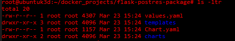
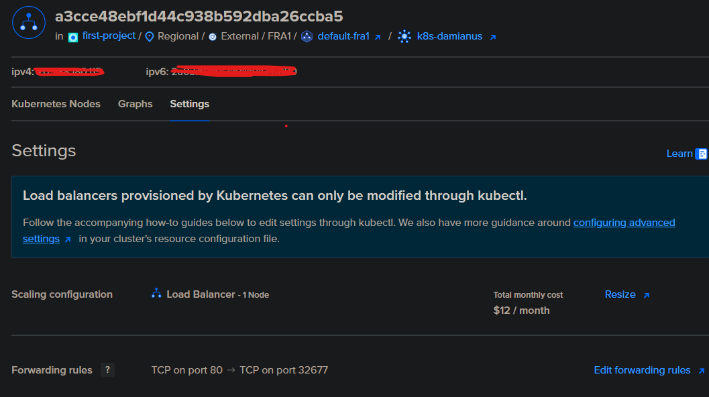

# k8s-web-app-load-balancer
Cloud K8s cluster setup and application deployment exposed to internet by load balancer

# Deploy Web App to DigitalOcean Kubernetes with Load Balancer

## Overview

This repository demonstrates how to deploy a **web application** to a **DigitalOcean Kubernetes (DO K8s)** cluster and expose it to external traffic using a **Load Balancer**. It uses a simple **Flask** app (Python) as the example application, lets adapt the template to any web application framework.

---

## Prerequisites

Before you begin, ensure you have the following:

### 1. **DigitalOcean Kubernetes Cluster**
   - A **DigitalOcean** account with an existing Kubernetes cluster.
   - If you haven't set up a Kubernetes cluster on DigitalOcean yet, follow [this guide](https://www.digitalocean.com/docs/kubernetes/quickstart/) to create one.

### 2. **kubectl**
   - Install and configure **kubectl** on your machine to interact with the Kubernetes cluster.
   - Ensure that `kubectl` is properly configured to connect to your DigitalOcean Kubernetes cluster. Use the following command to verify:
   
     ```bash
     kubectl config get-contexts
     ```

### 3. **Docker**
   - **Docker** must be installed on your local machine to build and push container images. Follow [Docker Installation](https://docs.docker.com/get-docker/) for setup.

### 4. **Docker Hub, AWS ECR, Digital Ocean registry or other Private Container Registry**
   - A **Docker Hub** is a free to play platform to host your Docker images.
   - Digital Ocean Container Registry is free to 500Mb(only one repository allowed)

   Links for registration:
   - https://www.docker.com/products/docker-hub/
   - https://www.digitalocean.com/products/container-registry
   - https://aws.amazon.com/ecr/
   

### 5. **doctl** 
  - Install and configure **doctl** on your machine to interact with the Digital Ocean cloud.
  - It helps to automate cluster creation and simplify your interaction with the cloud in general
  - Installation on all platforms described here - https://github.com/digitalocean/doctl/releases
---

## Application Structure

This repository consists of the following components:

### 1. **Web Application**
   - The web application is a **Flask** app that that enable users to register log in and create various notes files.
   - The "backend" part is a postgres database that contains all transaction login and structure for our data 
   - The application is containerized using Docker.

### 2. **Kubernetes Configuration**
   - The **Kubernetes** configuration files are located in the `k8s/` folder:
     - **`flask-deployment.yaml`**: Defines the **Deployment** resource that manages the web app pod.
     - **`flask-service.yaml`**: Defines the internal Kubernetes service to route traffic to the app.
     - **`postgres-deployment.yaml`**: Defines the **Deployment** resource that manages thepostgres database pod.
     - **`postgres-service.yaml`**: Defines the internal Kubernetes service to route traffic to the postgres database.
     - **`loadbalancer.yaml`**: Configures the **LoadBalancer** to expose the app to external traffic.

---

## Kubernetes Cluster Setup

Follow these steps to configure and deploy your application on **DigitalOcean Kubernetes**:

### 1. **Set Up DigitalOcean Kubernetes Cluster**

If you haven't created a Kubernetes cluster yet on DigitalOcean, follow the steps below:

- **Create a Kubernetes Cluster on DigitalOcean**: 
  Go to the [DigitalOcean Kubernetes Setup](https://www.digitalocean.com/docs/kubernetes/quickstart/) page and follow the instructions to create a cluster.

If GUI installation is not enough for you, here i prepared a script that automates the process

```bash
#!/bin/bash

# Variables
CLUSTER_NAME="randomname"       # Set your cluster name
REGION="fra1"                       # Change to your desired region (e.g., nyc3, sfo3, ams3, etc.)
NODE_SIZE="s-2vcpu-4gb"             # Change to the desired node size
NODE_COUNT=3                        # Number of nodes in your cluster
K8S_VERSION="latest"                # You can specify the version if needed (e.g., 1.21.5-do.1)
DOCKER_VERSION="latest"             # Docker version for the nodes
SSH_KEY_PATH="~/.ssh/id_rsa.pub"    # Path to your SSH public key (used for the nodes)

# Create a Kubernetes Cluster
echo "Creating Kubernetes cluster in region: $REGION"
doctl kubernetes cluster create $CLUSTER_NAME \
  --region $REGION \
  --size $NODE_SIZE \
  --node-count $NODE_COUNT \
  --version $K8S_VERSION \
  --ssh-keys $(cat $SSH_KEY_PATH) \
  --tag $CLUSTER_NAME

# Check if the cluster creation is successful
if [ $? -eq 0 ]; then
  echo "Kubernetes cluster '$CLUSTER_NAME' created successfully!"
else
  echo "Failed to create Kubernetes cluster."
  exit 1
fi

# Wait for the Kubernetes cluster to be provisioned (it may take a few minutes)
echo "Waiting for the Kubernetes cluster to be ready..."
sleep 60  # You can increase this depending on how long it takes for your cluster to be ready

# Get the kubeconfig file for the newly created cluster
echo "Configuring kubectl to use the newly created cluster..."
doctl kubernetes cluster kubeconfig save $CLUSTER_NAME

# Verify kubectl configuration
kubectl get nodes

```
  
- **Access the Cluster**:
  After the cluster is set up, you'll need to configure `kubectl` to access your cluster. Follow these instructions to download the kubeconfig file and set it up:

  ```bash
  doctl kubernetes cluster kubeconfig save <your-cluster-name>
  ```

## Helm package

Helm is a package manager for Kubernetes that simplifies application deployment, management, and versioning using reusable configuration templates called charts. It streamlines Kubernetes operations by enabling users to define, install, and upgrade applications efficiently.
Lets deploy a dedicated package for our application
```bash
helm create flask-postgres-package
cd flask-postgres-package
```

Here what we recieve 




values.yaml : define your Python app configurations (image, replicas, environment variables, etc.).
templates : stores your yaml config files (deployment,services, ingres etc)

so we simply move configuration files stored in k8s/ folder to templates, then we are able to run our application by one helm cmd

```bash
helm install package-name
```

## LoadBalancer vs Nginx Ingress

**LB How It Works**
Creates an external load balancer in your cloud provider (e.g., AWS ELB, Google Cloud Load Balancer, DigitalOcean Load Balanser).

Directly forwards traffic to the Flask app’s Kubernetes service.

Suitable for single-service applications.

**Ingress**
Routes traffic to multiple services based on hostname (flask.example.com) or path (/api/).

Uses a single external LoadBalancer (saves cost).

Requires an Ingress Controller (e.g., Nginx Ingress) to manage traffic.

Summary: If you are able to configure a bit its no-brainer to use nginx. Its free and provide more options but i will show you configs for both options

### 1. LoadBalancer setup

As mentioned its very simple, we use cloud provider so its Digital Ocean internal loadbalancer. Below you see settings and cost for one node



To provision it we need following service:

```yaml
apiVersion: v1
kind: Service
metadata:
  name: flask-service
spec:
  selector:
    app: flask-app
  ports:
    - protocol: TCP
      port: 80
      targetPort: 5000
  type: LoadBalancer
```

### 2. Nginx Ingress

installation by helm

```bash
helm repo add ingress-nginx https://kubernetes.github.io/ingress-nginx  ## add the repo
helm repo update ## update the repo
helm install nginx-ingress ingress-nginx/ingress-nginx --create-namespace --namespace ingress-nginx ## installation


```

Then adjust ingress file to your deployment, here an example :

```yaml
apiVersion: apps/v1
kind: Deployment
metadata:
  name: flask-app
spec:
  replicas: 2
  selector:
    matchLabels:
      app: flask-app
  template:
    metadata:
      labels:
        app: flask-app
    spec:
      containers:
      - name: flask
        image: my-flask-app:latest  # Replace with your Flask Docker image
        ports:
        - containerPort: 5000
---
apiVersion: v1
kind: Service
metadata:
  name: flask-service
spec:
  selector:
    app: flask-app
  ports:
  - protocol: TCP
    port: 80
    targetPort: 5000
  type: ClusterIP
```
Most important line is **metadata: name: flask-service** by this selector we gonna attach ingress to the service, look at ingress file :

```yaml
apiVersion: networking.k8s.io/v1
kind: Ingress
metadata:
  name: flask-ingress
  annotations:
    nginx.ingress.kubernetes.io/rewrite-target: /
spec:
  rules:
  - host: flask.example.com  # Replace with your domain
    http:
      paths:
      - path: /
        pathType: Prefix
        backend:
          service:
            name: flask-service
            port:
              number: 80
```

if you use helm for app deployment, you must add ingress.yaml file to helm-chart/templates folder


